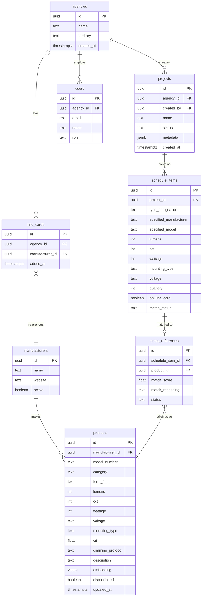

# feat: Lighting Product Cross-Reference Tool

## Overview

A web app for commercial lighting sales agencies to quickly cross-reference luminaire schedules from construction documents against their line card. The app identifies specified products not represented by the agency, finds equivalent alternatives from manufacturers the agency does represent, and generates a submittal package.

**Target user:** Lighting rep agency salespeople who receive bid requests containing luminaire schedules and need to propose a complete lighting package from their represented manufacturers.

## Problem Statement

When a rep agency receives a luminaire schedule, they must manually:
1. Identify which specified manufacturers they represent
2. For unrepresented manufacturers, research equivalent products from their line card
3. Match on form factor, lumens, CCT, mounting type, price, quality, and other specs
4. Compile a full submittal document with cut sheets and part numbers

This research-heavy process is the bottleneck in responding to bid requests. Automating the cross-reference step lets agencies respond faster and bid more projects.

## Proposed Solution

A Next.js web app deployed on Vercel with Supabase backend that:

1. **Parses** uploaded CSV/Excel luminaire schedules
2. **Identifies** line items not on the agency's line card
3. **Finds equivalents** using hybrid search (structured filtering + AI semantic matching)
4. **Presents matches** for user review and selection
5. **Generates** a PDF submittal package

## Technical Approach

### Architecture

```
Next.js App (Vercel)
├── File Upload → PapaParse (CSV) / SheetJS (Excel)
├── Column Mapping UI → Auto-detect + manual override
├── Matching Pipeline
│   ├── Structured filter (form factor, CCT, voltage, mounting)
│   ├── Vector similarity (Supabase pgvector + OpenAI embeddings)
│   └── LLM re-ranking (Claude/GPT for top candidates)
├── Review UI → Accept/reject/override per line item
└── PDF Generation → @react-pdf/renderer

Supabase Backend
├── PostgreSQL + pgvector
├── Tables: agencies, line_cards, products, projects, schedules
├── RPC: match_products (vector similarity + structured filters)
└── Storage: generated PDFs, uploaded schedules
```

### Tech Stack

| Layer | Technology | Rationale |
|-------|-----------|-----------|
| Frontend | Next.js 15 + React | Your preferred stack, Vercel-native |
| Styling | Tailwind CSS | Fast iteration |
| File parsing | PapaParse + SheetJS | Industry-standard, TypeScript support |
| Database | Supabase (PostgreSQL + pgvector) | You have MCP tools, built-in vector search |
| AI matching | OpenAI text-embedding-3-small | $0.02/1M tokens, 1536-dim vectors |
| LLM verification | Claude API | Re-rank top candidates with reasoning |
| PDF | @react-pdf/renderer | React components for PDF layout |
| Auth | Supabase Auth | Built-in, handles email/password + magic links |
| Deployment | Vercel | Your existing platform |

### Database Schema



### Product Matching Pipeline

```
Schedule Item (e.g., "Acuity LDN6 6" downlight, 3000lm, 3000K, 0-10V")
    │
    ▼
Step 1: Structured Filter
    - form_factor = "downlight"
    - mounting_type = "recessed"
    - cct = 3000
    - voltage matches
    - manufacturer IN (line_card_manufacturers)
    - discontinued = false
    │
    ▼
Step 2: Vector Similarity (pgvector)
    - Embed schedule item description
    - cosine similarity against product embeddings
    - Top 20 candidates from Step 1 results
    │
    ▼
Step 3: Weighted Scoring
    - Lumen match (±10% tolerance): 30%
    - Form factor exact match: 25%
    - CCT exact match: 20%
    - CRI/color quality: 15%
    - Dimming compatibility: 10%
    │
    ▼
Step 4: LLM Re-ranking (top 5)
    - Claude evaluates spec sheets side-by-side
    - Returns ranked list with reasoning
    │
    ▼
Result: Ranked alternatives with confidence scores + reasoning
```

### Key Screens

1. **Dashboard** - List of projects, quick-start upload
2. **Line Card Manager** - Add/remove manufacturers, view represented products
3. **Upload & Map** - Drag-drop file, preview table, map columns
4. **Cross-Reference Review** - Table of all schedule items, match status, proposed alternatives with accept/reject per row
5. **Submittal Preview** - PDF preview with download

## Acceptance Criteria

### Core Functionality
- [ ] User can create an agency account and define their line card (list of manufacturers)
- [ ] User can upload CSV or Excel luminaire schedule
- [ ] App auto-detects common column headers (Type, Manufacturer, Model, Lumens, CCT, Wattage, Mounting)
- [ ] User can manually map columns if auto-detect fails
- [ ] App identifies which schedule items are from manufacturers on the line card
- [ ] App finds and ranks equivalent products from line card manufacturers for unmatched items
- [ ] User can review, accept, reject, or override each proposed alternative
- [ ] User can manually search the product database when no match is found
- [ ] App generates a downloadable PDF submittal with specified and alternative products listed

### Data Management
- [ ] Admin can bulk-import product catalog data (CSV/Excel)
- [ ] Products have structured specs (lumens, CCT, wattage, form factor, mounting, voltage, dimming, CRI)
- [ ] Products have vector embeddings for semantic search
- [ ] Projects are saved and can be reopened/modified
- [ ] Line card changes do not affect existing projects

### Quality
- [ ] Match suggestions include confidence score and reasoning
- [ ] "No match found" items are clearly flagged with option for manual entry
- [ ] File parsing errors show helpful messages (which row/column failed)
- [ ] Works on schedules with 1-500 line items

## Technical Considerations

### Product Database Bootstrapping

The biggest cold-start challenge is populating the product database. Options:

1. **Manual CSV import** (MVP) - Agency uploads manufacturer product lists as CSV
2. **Web scraping** - Pull specs from manufacturer websites (fragile, maintenance-heavy)
3. **CatalogIQ API** - Commercial lighting data API (paid, limited manufacturer coverage)
4. **DLC QPL API** - DesignLights Consortium qualified products list (paid, good for DLC-listed products)
5. **AI extraction** - Feed manufacturer PDF catalogs to Claude for structured extraction

**Recommendation for MVP:** Start with manual CSV import (#1) + AI extraction from PDF catalogs (#5). This gives agencies control and covers manufacturers without API access.

### Matching Accuracy

- Exact CCT match required (specifiers are specific about color temperature)
- Lumens tolerance: ±10% (industry standard)
- Form factor must be exact (can't substitute a track light for a recessed downlight)
- Dimming protocol must be compatible (DALI != 0-10V)
- CRI: minimum 80 for commercial, ±5 points tolerance

### Performance

- File parsing: client-side for instant preview, server-side for validation
- Matching: batch all unmatched items, run structured filter in SQL, vector search in pgvector
- Expected latency: <5s for 100-item schedule matching against 10K product database
- PDF generation: server-side, async with download link

### Security

- Row Level Security on all Supabase tables (agency isolation)
- File uploads validated server-side (type, size ≤10MB)
- No sensitive financial data stored
- Supabase Auth handles sessions

## Success Metrics

- Agency can process a 50-item luminaire schedule and generate a submittal in under 15 minutes (vs hours manually)
- Match suggestion acceptance rate >70% (measures AI matching quality)
- Return usage (agencies use it for multiple projects)

## Dependencies & Risks

| Risk | Impact | Mitigation |
|------|--------|------------|
| Product database empty at launch | No matches possible | Seed with major manufacturers via CSV import + AI extraction from catalogs |
| Poor match quality | Users lose trust | Show confidence scores, let users override, learn from corrections |
| Inconsistent luminaire schedule formats | Parsing fails | Column mapping UI, template download, saved mappings per agency |
| Manufacturer data goes stale | Discontinued products suggested | `discontinued` flag, periodic review workflow, user reporting |
| Large schedules slow to process | Bad UX | Background processing with progress indicator, batch matching |

## MVP Scope

For the first working version, focus on:

1. Single agency account (no multi-tenant yet)
2. CSV upload only (Excel in v2)
3. Manual product database via CSV import
4. Structured matching only (no AI/embeddings yet - add in v2)
5. Basic PDF submittal (product list with specs, no cut sheets)
6. Core review UI (accept/reject per line item)

This gets a usable tool in front of users fast. AI matching and richer submittals come in v2.

## Project Structure

```
cross-tool/
├── app/
│   ├── page.tsx                    # Dashboard
│   ├── layout.tsx                  # Root layout with auth
│   ├── login/page.tsx              # Auth
│   ├── line-card/page.tsx          # Line card management
│   ├── products/
│   │   ├── page.tsx                # Product catalog browser
│   │   └── import/page.tsx         # Bulk product import
│   ├── projects/
│   │   ├── page.tsx                # Project list
│   │   ├── new/page.tsx            # Upload & map schedule
│   │   └── [id]/
│   │       ├── page.tsx            # Cross-reference review
│   │       └── submittal/page.tsx  # Submittal preview & download
│   └── api/
│       ├── match/route.ts          # Matching pipeline
│       └── generate-pdf/route.ts   # PDF generation
├── lib/
│   ├── supabase/
│   │   ├── client.ts
│   │   ├── server.ts
│   │   └── types.ts                # Generated from Supabase
│   ├── parsers/
│   │   ├── csv.ts                  # PapaParse wrapper
│   │   ├── excel.ts                # SheetJS wrapper
│   │   └── column-mapper.ts        # Auto-detect + manual mapping
│   ├── matching/
│   │   ├── structured.ts           # SQL-based structured filter
│   │   ├── scoring.ts              # Weighted scoring algorithm
│   │   └── pipeline.ts             # Orchestrates matching steps
│   └── pdf/
│       ├── submittal.tsx           # React PDF submittal template
│       └── components.tsx          # Reusable PDF components
├── types/
│   └── index.ts                    # Shared TypeScript types
├── supabase/
│   └── migrations/
│       ├── 001_initial_schema.sql
│       └── 002_match_functions.sql
├── public/
├── package.json
├── next.config.ts
├── tailwind.config.ts
└── tsconfig.json
```

## References

### External Documentation
- [CatalogIQ Lighting API](https://catalogiq.app/lighting-industry-api) - Commercial lighting product data API
- [DesignLights Consortium QPL](https://designlights.org/qpl/) - Qualified products database
- [IES LM-63-19](https://blog.ansi.org/ansi/standard-file-photometric-data-ies-lm-63-19/) - Photometric data standard
- [Supabase pgvector](https://supabase.com/docs/guides/database/extensions/pgvector) - Vector search in PostgreSQL
- [PapaParse](https://www.papaparse.com/) - CSV parsing library
- [SheetJS](https://sheetjs.com/) - Excel parsing library
- [@react-pdf/renderer](https://react-pdf.org/) - React-based PDF generation
